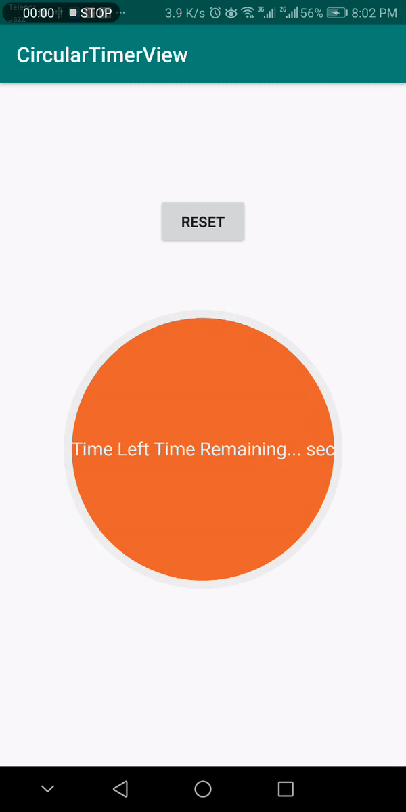
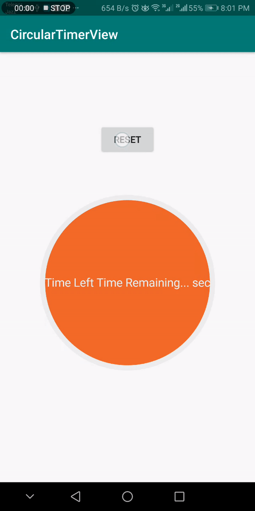
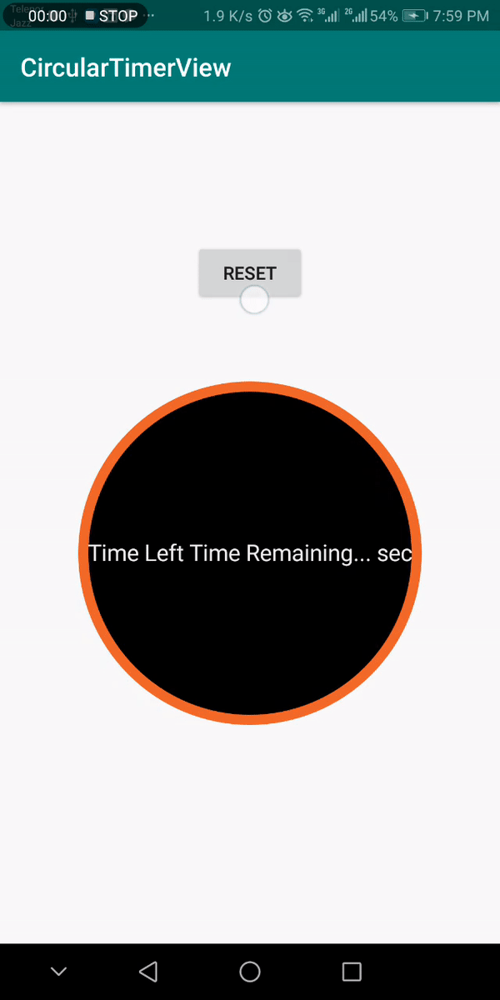
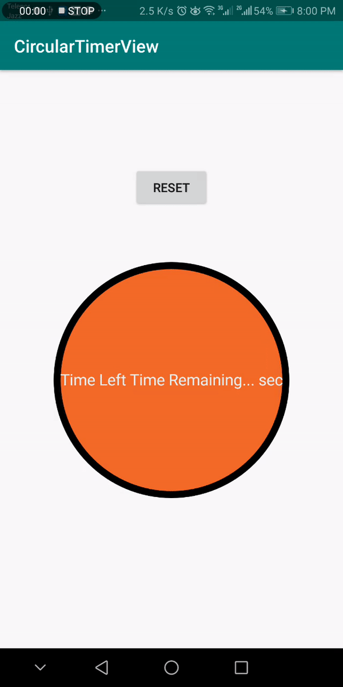

# CircularTimerView
[](https://jitpack.io/#uzairiqbal91/CircularTimerView)

A simple library for creating circular progress bar timer view for Android.

## Examples

                    
                    



## Installation

- Get it via gradle: ``` implementation 'com.github.uzairiqbal91:CircularTimerView:1.0' ```
## Usage

1) Add CircularTimerView to your layout

```xml
    <com.uzairiqbal.circulartimerview.CircularTimerView
        android:id="@+id/progress_circular"
        android:layout_width="wrap_content"
        android:layout_height="wrap_content"
        app:progressColor="#000"
        app:backgroundColor="#e76130"
        app:progressBackgroundColor="#eee"
        app:backgroundWidth="8"
        app:isClockwise="true"
        app:textSize="18sp"
        app:prefix="Time Left "
        app:suffix=" sec"
        app:progressText="Time Remaining..."
        app:maxValue="100"
        app:startingPoint="bottom"
        app:progressTextColor="#eee"/>
```

2) Get it from your activity/fragment etc.

```java
    CircularTimerView progressBar = findViewById(R.id.progress_circular);
    progressBar.setProgress(0);


// To Initialize Timer
     progressBar.setCircularTimerListener(new CircularTimerListener() {
            @Override
            public String updateDataOnTick(long remainingTimeInMs) {
                return String.valueOf((int)Math.ceil((remainingTimeInMs / 1000.f)));
            }

            @Override
            public void onTimerFinished() {
                Toast.makeText(MainActivity.this, "FINISHED", Toast.LENGTH_SHORT).show();
                progressBar.setPrefix("");
                progressBar.setSuffix("");
                progressBar.setText("FINISHED THANKS!");
            }
        }, 10, TimeFormatEnum.SECONDS, 10);


// To start timer

    progressBar.startTimer();


```

You can modify it programmatically if you want

<b>Setters</b>

```java
	progressBar.setProgress(progress); 		// set progress value
	progressBar.setMaxValue(100); 			// set progress max value
	progressBar.setStrokeWidthDimension(10); 		// set stroke width
	progressBar.setBackgroundWidth(10); 		// set progress background width
	progressBar.setProgressColor("#FF6FD99D"); 	// set progress color
	progressBar.setBackgroundColor("#FFF9916B"); 	// set progress backgorund color
	progressBar.setText(String.valueOf(progress)); 	// set progress text
	progressBar.setTextColor("#FF6FD99D"); 		// set text color
	progressBar.setSuffix("%"); 			// set suffix
	progressBar.setPrefix(""); 			// set prefix
	progress.setClockwise(true);                // clocksie if false than anticlockwise timer rotation
	progress.setStartingAngle(top);             // top means start timer from top 
	
	 

```

<b>Getters</b>

```java
	progressBar.getProgress();			// get progress value
	progressBar.getProgressPercentage();		// get progress percentage
	progressBar.getMaxValue();			// get progress max value
	progressBar.getStrokeWidthDimension();			// get stroke width
	progressBar.getBackgroundWidth();		// get progress background width
	progressBar.getProgressColor();			// get progress color
	progressBar.getBackgroundColor();		// get progress backgorund color
	progressBar.getText();  			// get progress text
	progressBar.getTextColor();			// get text color
	progressBar.getSuffix();			// get suffix
	progressBar.getPrefix();			// get prefix
	progressBar.getClockwise();             // getclocksise boolean
	progressBar.getStartingAngle();         // get startangle
	
	
```

## LICENSE


MIT License

Copyright (c) 2019 hamzaahmedkhan and uzairiqbal91

Permission is hereby granted, free of charge, to any person obtaining a copy
of this software and associated documentation files (the "Software"), to deal
in the Software without restriction, including without limitation the rights
to use, copy, modify, merge, publish, distribute, sublicense, and/or sell
copies of the Software, and to permit persons to whom the Software is
furnished to do so, subject to the following conditions:

The above copyright notice and this permission notice shall be included in all
copies or substantial portions of the Software.

THE SOFTWARE IS PROVIDED "AS IS", WITHOUT WARRANTY OF ANY KIND, EXPRESS OR
IMPLIED, INCLUDING BUT NOT LIMITED TO THE WARRANTIES OF MERCHANTABILITY,
FITNESS FOR A PARTICULAR PURPOSE AND NONINFRINGEMENT. IN NO EVENT SHALL THE
AUTHORS OR COPYRIGHT HOLDERS BE LIABLE FOR ANY CLAIM, DAMAGES OR OTHER
LIABILITY, WHETHER IN AN ACTION OF CONTRACT, TORT OR OTHERWISE, ARISING FROM,
OUT OF OR IN CONNECTION WITH THE SOFTWARE OR THE USE OR OTHER DEALINGS IN THE
SOFTWARE.

